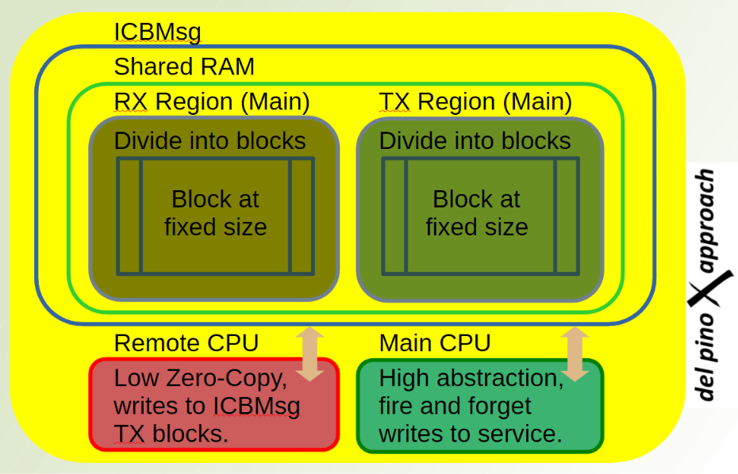

# 👋 Hi, I'm Kent del Pino
## Firmware & Electronics, Edge & Endpoint AI, full lifecycle experience.

An engineer with product development experience, bridging the gap between bare-metal silicon, high-efficiency electronics, and embedded machine learning. I architect low-latency, real-time systems that squeeze maximum performance out of multi and single-core SoCs.

---

### 🚀 Technical skills

* **Languages:** `C` (MISRA C), `Python` (Qt / PySide6 for tooling), `Assembly`, `Pascal`
* **Real-Time Architectures:** Multi & single-core SoCs, Bare-Metal setups, Bootloaders, and RTOS environments, as in:
  * [Zephyr Project](https://zephyrproject.org) & [Eclipse ThreadX](https://threadx.io) & [Nucleus RTOS](https://resources.sw.siemens.com/en-US/fact-sheet-nucleus-rtos/).
* **Silicon Ecosystems:** Arm Cortex-M(R) & small RISC-V architectures from **NXP, Texas Instruments, STMicroelectronics, and Nordic Semiconductor**.
* **Hardware & PCB Design:** High-efficiency drivers, [motor controllers](https://www.linkedin.com/feed/update/urn:li:activity:7467292623100219392/) and industrial [IoT hardware](https://www.instagram.com/kentdelpino/), and I like KiCad.
* **Specialized Domains:** 
  * **Navigation:** GNSS & Inertial Navigation Systems (INS) — *Check out `/old_stuff` down in this repository for historical algorithmic roots applicable to modern blind-navigating drones.*
  * **Connectivity:** NB-IoT, LTE, sub-GHz wireless and wired CAN Bus, CANopen. 

---

### 🧠 Featured Edge AI, Drivers & custom Kernel

* **[emlearn_play](https://github.com/kentdelpino/emlearn_play)**
  * Pushing the boundaries of resource-constrained **Edge/Endpoint AI**.
* **[MSPM0 SPI Flash High-Efficiency Driver](https://bitbucket.org/delpino/mspm0-spi-flash/src/main/)**
  * Low-load, low-footprint, strong-throughput, optimized driver for the TI MSPM0G (Cortex-M0+).
* **[MICK (Minimum Inter-process Communication Kernel)](https://bitbucket.org/delpino/mick/src/master/)**
* *Of course, real nerds can present their own scheduler.* A custom, lightweight preemptive scheduler with tiny Inter-process Communication (IpC) capacity.

---

### ⚡ Deep Dive: Inter-Core Block Messaging (ICBMsg)

> **Angle of Attack:** Investigate deeply, formulate abstractly, implement efficiently. This is an architectural breakdown of optimized Inter-Processor Communication (IPC) scaled for ultra-low-power, dual-core devices like the **Nordic nRF54L**.

#### 📋 Overview
`ICBMsg` is a highly specialized variant of **Inter-Core Messaging (ICMsg)** utilizing **Dynamically Allocated Buffers** across separate shared memory regions (`rx-region` and `tx-region`). It is built to stream massive quantities of lightweight, pre-processed telemetry packets, timestamps, and diagnostics upstream (remote CPU → main CPU) while piping commands downstream (main CPU → remote CPU).

#### ⚙️ Technical Blueprint
* **Capabilities:** Multi-Endpoint Routing, Multithreading support, and Zero-Copy memory paradigms.
* **Scope Limits:** Strictly engineered for **RTOS-to-RTOS** or **RTOS-to-Bare-Metal** asymmetric multiprocessing (AMP). Deeply embedded application processors running full operating systems (like a Linux box) are explicitly out of scope.
* **Topology:** Ideal for architectures where a remote Co-processor acts as a fully decoupled execution engine, crunching algorithmic tasks independently and streaming results.

#### ⚖️ Architectural Trade-Offs

| Paradigm | Component Layer | Concurrency & Threading Model | Memory & Performance Impact |
| :--- | :--- | :--- | :--- |
| **Pure ICBMsg** *(No Zbus)* | Core-Centric | **Task-agnostic.** On the receiving side, it relies entirely on execution within Interrupt Service Routines (ISR) rather than thread-level scheduling. | **Ultra-lightweight footprint.** Easily yields **5 Mbps bandwidth** for variable-length, multi-endpoint packets on nRF54L devices. Highly optimized for systems where remote I-Code must live entirely within tiny local SRAM rather than Flash/ROM. |
| **With Zbus Proxy Agent** | Thread/Task-Centric | Provides high-level thread abstractions, bridging notifications cleanly across decoupled execution tasks. | Introduces minor abstraction overhead, but significantly simplifies asynchronous message routing across complex, multi-threaded firmware. |

#### ⚡ Zero-Copy Mechanics

* **Remote Co-Processor (Single-Threaded Zephyr Model):** 
  True zero-copy operations are highly viable and explicitly recommended here to save clock cycles and prevent buffer copies in tightly constrained memory layouts.
* **Main Application Processor (Multi-Threaded Layout):** 
  Zero-copy is bypassed intentionally here in favor of a clean **"fire-and-forget" abstraction**. Calling Zephyr's native `ipc_service_send()` automatically handles memory duplication, mitigating data race conditions across concurrent tasks.

---

### 👯 Let's Build Together
This architecture is just one example of the source code, hardware design patterns, and systems engineering experience I bring to a team. If you want to talk low-latency firmware, custom schedulers, or edge inference, connect with me!

📬 **[Find me on LinkedIn](http://uk.linkedin.com/in/kentdelpino)**

***
*Crafted with ☕ and optimized C compilation patterns.*
